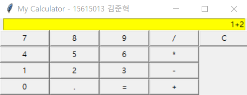

# python_gui_calculator
> 파이썬으로 작성한 GUI 계산기 프로그램

## Usage example

tkinter 모듈을 사용하여 버튼을 누르거나 키보드로 입력하여 사칙연산을 수행하는 계산기 프로그램을 작성함.

소수점 연산 가능.

Enter키를 눌러 계산 수행 가능.

## Development setup

Python Version:
3.7.0

## Release History

* complete: GUI calculator using python
    * UI 및 계산 기능 구현 완료

* fix: entry, button width
    * 입력창 및 버튼 크기 수정

## Meta

김준혁 – kimjunhyeok.it@gmail.com
